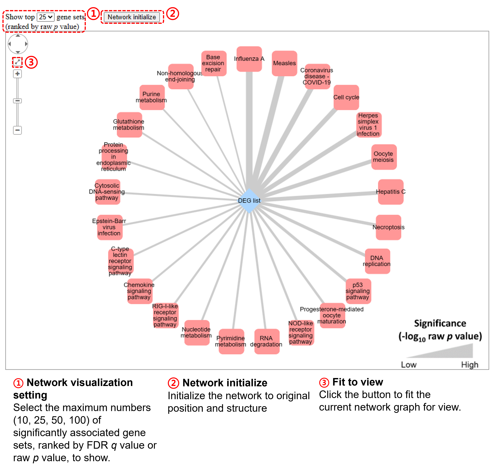

# GscorePy
**GscorePy** is a python implementation of Gscore.

**Gene Set Correlation Enrichment (Gscore)** is an online tool for interpreting and annotating gene expression dataset by using a dataset-derived coexpression network to measure the statistical significance of associations between your interesting differentially expressed gene (DEG) list (i.e., query) and the collection of gene sets. Based on the hypergeometric distribution with Benjamini–Hochberg correction, the tool identifies the coexpressed gene pairs between: 
  
**(1) individual DEG** in the query DEG list and all the DEGs of a certain gene set in the selected collection to determine its association significance;  
**(2) query DEG list** and all the DEGs of a certain gene set in the selected collection to determine its association significance. 

More details about Gscore:  
[Gscore tutorial on the Gscore website](https://gscore.ibsb.nycu.edu.tw/tutorial.html)  
[Gscore github](https://github.com/SysMednet/Gscore)  

### **Publication**  
Chang, L. T.<sup>+</sup>, Lee, M. Z.<sup>+</sup>, Wu, Y. J.<sup>+</sup>, Lee, W. k., Ma, C. L., Chang, J. M., Chen, C. W., Huang, T. C., Lee, C. H., Lee, J. C., Tseng, Y. Y., Lin, C. Y. * (2023). Gene set correlation enrichment analysis for interpreting and annotating gene expression profiles, Nucleic Acids Research, gkad1187.  
[[LINK]](https://doi.org/10.1093/nar/gkad1187)  [[PDF]](https://academic.oup.com/nar/advance-article-pdf/doi/10.1093/nar/gkad1187/54448061/gkad1187.pdf)

## Dependencies and requirement  
The GscorePy source code is written in [python 3.9.13](https://www.python.org/downloads/release/python-3913/). Users also need to install following python package listed below:  
* numpy
* pandas
* scipy
* statsmodels
* matplotlib
* importlib
* seaborn
  
## Installation
```shell
pip install git+https://github.com/SysMednet/GscorePy
```
If the error message "cannot find command git" was shown, please install "git".
```shell
conda install git
```

## Variable
### gscore function (defined in Gscore.py)
```python
def gscore(GEM, 
           DEG, 
           gene_set='KEGG', 
           species='hsa', 
           ID_type='entrez', 
           pcc_cutoff=0.5, 
           criterion='fdrq', 
           output_dir=None, 
           coexp_detail=False, 
           ratio_plot=False, 
           coexp_graph=False)
```
Variable | Description  
------------ | ------------- 
GEM | The directory of gene expression data (.txt). This variable can not be empty. See the data format explaination [below](#Gene-expression-data-format).
DEG | The directory of differentially expressed gene data (.txt). This variable can not be empty. See the data format explaination [below](#Differentially-expressed-gene-data-format).
gene_set | The directory of gene sets data (.txt), or the users can use the default gene sets data in our database ("KEGG","Reactome","GO_BP","GO_CC","GO_MF"). See the details [below](#Gene-sets-data-format).
species | The species ID (defined by KEGG) is used to choose defualt gene sets data in our database, there are 7 species can choose ("hsa","mmu","dre","dme","cel","rno","sce"). See the details [below](#Gene-sets-data-format).
ID_type | Users can choose "entrez" or "symbol", users should check if their gene ID type in input data is correct. Default : "fdrq".
pcc_cutoff | The cutoff for \| pearson correlation coefficient \|, which should be set between 0 and 1. Default : 0.5.
criterion | The significance criterion for determining the association. "fdrq"(Benjamini–Hochberg method) or "pv"(raw <i>p</i> value) can be chosen, default : "fdrq". (FDR<i>q</i> $\le$ 0.05 or raw <i>p</i> $\le$ 0.05)
output_dir | The output directory (folder), all output files will save in this folder. This variable can not be empty. See the output details [below](#Individual-DEG-result-and-DEG-list-result).
coexp_detail | Set this variable "True" to output the list of coexpressed DEG pairs. See the output format explaination [below](#Coexpressed-DEG-pairs-output-file-format).
ratio_plot | Set this variable "True" to output the dotplot (.png) of the ratios of coexpressed DEG pairs (m/n) vs significantly associated gene sets. See the example figure [below](#Ratio-dotplot).
coexp_graph | Set this variable "True" to output the cytoscape network revealed by offline webpage (.html). See the details and example webpage [below](#Network-graph).

### Gene expression data format
[[Back to variable table]](#gscore-function-defined-in-gscorepy)  
There are three available gene expression matrix (GEM) format can be used, please note that:
* Each elements should be delimited by **tab (\t)**.
* There should be at least 5 case samples.
* The gene ID should be entrez ID or gene symbol.
1. GEM with two types of phenotype. The phenotype of the sample should be labeled by "0" or "1" which represents "control" and "case", respectively.
```
Phenotype  0  1  0  0  1  1  ...
gene1  1.32762  2.63735  3.28497  2.80999  2.06477  5.43987  ...
gene2  0.78467	2.10675  1.55954  2.52396  5.55138  2.74120  ...
gene3  4.63834	2.46628  1.62849  10.0764  7.20375  3.68444  ...
gene4  3.74739	4.32639  4.74154  3.41298  4.33184  4.28809  ...
gene5  2.57056	3.40008  1.81487  5.07296  3.32992  3.28303  ...
```
2. GEM with only single type of phenotype. In this case, all the samples will be considered as case samples. Note that the phenotype can be labeled by any character but can only use one label type.
```
Phenotype  1  1  1	...
gene1  2.63735  2.06477  5.43987  ...
gene2  2.10675  5.55138  2.74120  ...
gene3  2.46628  7.20375  3.68444  ...
gene4  4.32639  4.33184  4.28809  ...
gene5  3.40008  3.32992  3.28303  ...
```
3. No phenotype label in GEM file. In this case, all the samples will be considered as case samples.
```
gene1  2.63735  2.06477  5.43987  ...
gene2  2.10675  5.55138  2.74120  ...
gene3  2.46628  7.20375  3.68444  ...
gene4  4.32639  4.33184  4.28809  ...
gene5  3.40008  3.32992  3.28303  ...
```

### Differentially expressed gene data format
[[Back to variable table]](#gscore-function-defined-in-gscorepy)  
A DEG file contains at least three genes, including two columns:
* The first column is the DEG criteria which will be used to construct the coexpression network.  
* The second column is used to define the query DEG list, the gene labeled by "0" or "1" which represents "not query DEG" and "query DEG", respectively.

Please note that:
* Each elements should be delimited by **tab (\t)**.
* Genes **MUST** use the same feature ID as the expression profiles (entrez ID or gene symbol).
```
gene1  1
gene2  1
gene3  1
gene4  1
gene5  0
gene6  1
gene7  0
...
```

### Gene sets data format
[[Back to variable table]](#gscore-function-defined-in-gscorepy)  
A gene set file contains at least one gene set(s), including the gene set names (or IDs) and their lists of genes.  
Please note that:
* The genes in these gene sets **MUST** use the same feature ID as the expression profiles (entrez ID or gene symbol).
* Every gene set must include at least one gene.

```
gene-set1  gene11  gene12  gene13  gene14  gene15  gene16
gene-set2  gene21  gene22  gene23  gene24  gene25  gene26
gene-set3  gene31  gene32  gene33  gene34  gene35
gene-set4  gene41  gene42  gene43  gene44  gene45  gene46
gene-set5  gene51  gene52  gene53  gene54
...
```
We provide several default gene sets in this package, including 7 species from 5 different collections with two different gene ID type (entrez ID and gene symbol).  
Users can choose the specific default gene set they need by these two variable in Gscore function:
* Set variable "gene_set" to selection the collection you want ("KEGG","Reactome","GO_BP","GO_CC","GO_MF").
* Set variable "species" to selection the species you want ("hsa","mmu","dre","dme","cel","rno","sce").

Species table
Full name | KEGG short name  
------------ | ------------- 
Homo sapiens | hsa
Mus musculus | mmu
Danio rerio | dre
Drosophila melanogaster | dme
Caenorhabditis elegans | cel
Rattus norvegicus | rno
Saccharomyces cerevisiae | sce

Gene set collection table
Collection | Version or date 
------------ | ------------- 
Kyoto Encyclopedia of Genes and Genome (KEGG) | Ver. 102
Reactome Pathway Database | Ver. 08.11.2021
Gene Ontology Biological Process (GO_BP) | Ver. 12.20.2020
Gene Ontology Cellular Component (GO_CC) | Ver. 12.20.2020
Gene Ontology Molecular Function (GO_MF) | Ver. 12.20.2020

## Usage and output format
### Import and execute Gscore function with python 
sample code in user_test.py
* All example input data can be found in test_input folder
* All example output data can be found in test_output folder

Every output files from this function will be saved in the folder set by output_dir variable.
```python
from gscorepy import gscore

gscore(GEM='test_input/GSE157103.txt', 
        DEG='test_input/allDEG.txt', 
        pcc_cutoff=0.7, 
        criterion='pv', 
        gene_set='KEGG', 
        species='hsa', 
        ID_type='entrez',
        output_dir = 'test_output/',
        coexp_detail=True,
        ratio_plot=True,
        coexp_graph=True)
```

### Individual DEG result and DEG list result
[[Back to variable table]](#gscore-function-defined-in-gscorepy)  
**Individual DEG** result output (Example file : "Individual_DEG_sig.associations.txt" in "test_output" folder)
* This result shows the significant associations between each DEG in the DEG list and each gene sets in the gene set collection.
* The result table will be grouped by gene_ID and sorted by p_value column in each group.

GeneSet | gene_ID	| N | M | n | m | p_value | FDR_q_value 
------------ | ------------- | ------------- | ------------- | ------------- | ------------- | ------------- | ------------- 
Alzheimer disease	| 100132406	| 155	| 19	| 8	| 4	| 0.00841512165628363	| 0.19581064097193132
RNA degradation	| 100132406	| 155	| 19	| 2	| 2	| 0.014327607875994974	| 0.19581064097193132
Protein digestion and absorption	| 100132406	| 155	| 19	| 2	| 2	| 0.014327607875994974	| 0.19581064097193132
Pathways of neurodegeneration - multiple diseases	| 100132406	| 155	| 19	| 7	| 3	| 0.04011389753523095	| 0.2792114695340502
Mucin type O-glycan biosynthesis	| 100132406	| 155	| 19	| 1	| 1	| 0.12258064516129032	| 0.2792114695340502
Glycerolipid metabolism	| 100132406	| 155	| 19	| 1	| 1	| 0.12258064516129032	| 0.2792114695340502

**DEG list** result output (Example file : "DEG_list_sig.associations.txt" in "test_output" folder)
* This result shows the significant associations between the query DEG list and each gene sets in the gene set collection.
* The result table will be sorted by p_value column.

GeneSet | N | M | n | m | p_value | FDR_q_value 
------------ | ------------- | ------------- | ------------- | ------------- | ------------- | ------------- 
Influenza A	| 45105	| 4919 | 2910	| 564	| 2.023591412811608e-44	| 3.8245877702139396e-42
Measles	| 45105	| 4919	| 2619	| 512	| 2.893305586300621e-41	| 2.734173779054087e-39
Coronavirus disease - COVID-19	| 45105	| 4919	| 3201	| 571	| 2.861210592445993e-34	| 1.8025626732409756e-32
Cell cycle	| 45105	| 4919	| 4074	| 677	| 3.5465567829188843e-31	| 1.6757480799291729e-29
Herpes simplex virus 1 infection	| 45105	| 4919	| 2619	| 471	| 5.416377513419858e-29	| 2.0473907000727063e-27
Oocyte meiosis	| 45105	| 4919	| 2037	| 377	| 1.357134092542624e-25	| 4.2749723915092664e-24

### Coexpressed DEG pairs output file format
[[Back to variable table]](#gscore-function-defined-in-gscorepy)  
This additional output can show the detail correlation (Pearson's r) between each DEG in the DEG list and each DEG in each gene set.  
We provide two coexpressed detail file, and both of them only show the DEG pairs with greater |Pearson's r| than the pcc_cutoff.
1. The result will be grouped by DEG in the DEG list. (Example file : "Individual_gene_coexpressed_detail.txt" in "test_output" folder)

Entrez ID of the individual DEG | Entrez ID in the gene set | Gene set | Pearson's r 
------------ | ------------- | ------------- | ------------- 
991	| 9133	| p53 signaling pathway	| 0.905121
991	| 891	| p53 signaling pathway	| 0.878674
991	| 6241	| p53 signaling pathway	| 0.85834
991	| 983	| p53 signaling pathway	| 0.819157
991	| 7083	| Pyrimidine metabolism	| 0.895685
991	| 7298	| Pyrimidine metabolism	| 0.862836

2. The result will be grouped by gene set. (Example file : "DEG_list_coexpressed_detail.txt" in "test_output" folder)

Gene set | Entrez ID in the gene set | Entrez ID in the DEG list | Pearson's r 
------------ | ------------- | ------------- | ------------- 
p53 signaling pathway | 983 | 983 | 1.0
p53 signaling pathway | 6241 | 6241 | 1.0
p53 signaling pathway | 9133 | 9133 | 1.0
p53 signaling pathway | 891 | 891 | 1.0
p53 signaling pathway | 6241 | 64151 | 0.957943
p53 signaling pathway | 6241 | 11130 | 0.955961

### Ratio dotplot
[[Back to variable table]](#gscore-function-defined-in-gscorepy)  
This additional output visualize the ratio of significantly associated gene sets by dotplot. (Example file : "Ratio_dotplot.png" in "test_output" folder)
* Ratio = m/n. m and n values have already record in DEG list result table.
* This figure only show up to 500 gene sets.
* The point size represent how many DEGs in the DEG list contribute at least one coexpressed gene pair with the DEGs in the gene set.


### Network graph
[[Back to variable table]](#gscore-function-defined-in-gscorepy)  
The offline webpage shows the significantly associated gene sets by network graph with cytoscape.js.  
Example webpage : double click the "GeneSet_network_graph.html" file in "test_output" folder, the webpage will show on your browser.  



